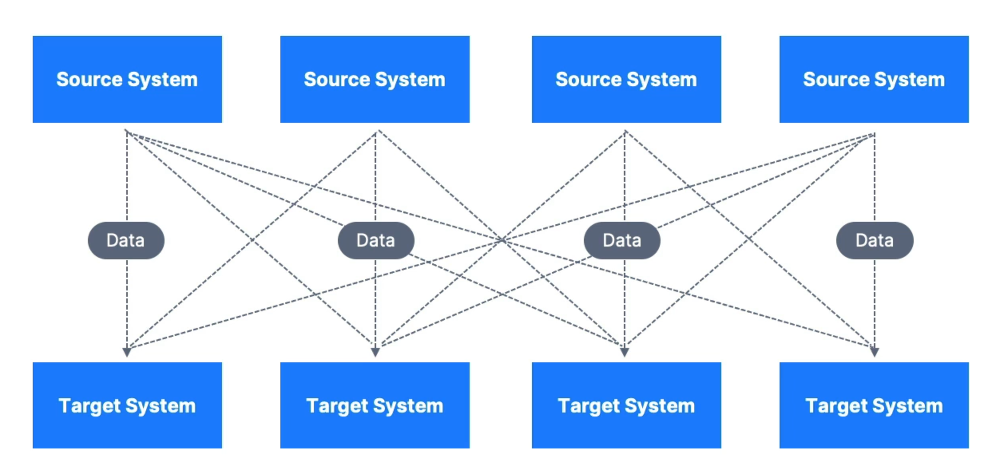
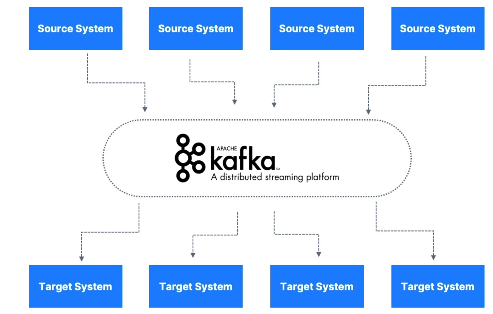
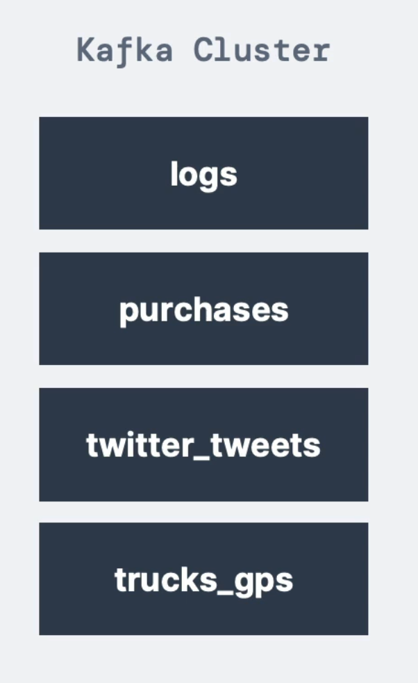
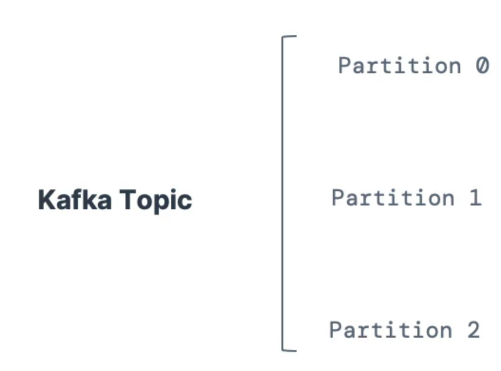
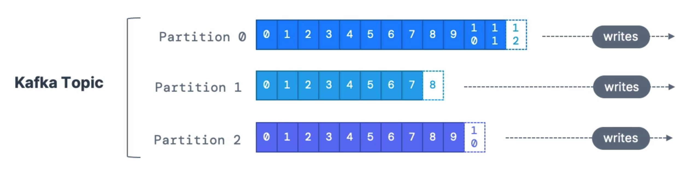

# Introducción

Apache Kafka proporcionar una plataforma unificada, de alto rendimiento y de baja latencia para la manipulación en tiempo real de fuentes de datos. Antes de Kafka si se tenía varias aplicaciones que requiere intercambiar datos entre todas ellas se volvia demasiado complicado:

    

 

Como se puede ver en la imagen, a tener varias aplicaciones origen que envia datos a aplicaciones destino entre sí, el flujo de datos se vuelve muy confuso de seguir por distintos motivos:
- Actualización del código
- Formatos de entrada: avro, json, etc..
- Protocolos. UDP, TCP, HTTP, etc..

Apache Kafka soluciona este problema a través desacoplamiento de aplicaciones:

    

 

Como se puede ver en la imagen, Kafka puede verse como una cola de mensajes, bajo el patrón publicación-suscripción, donde los distintos orígenes publican distintos datos y cada destino se suscribe a ellos para recoger la información que se quiera recibir.

## Topis, Partirtitions y offsets

### Topis
- **Topic**: es un stream de datos.
    - Es similar a una tabla de base de datos (sin todas las limitaciones)
    - Se puede tener los topics que se quiera
    - Un topic se identifica con un nombre (se puede poner cualquiera)
    - Es inmutable, cada vez que se envia algo ya no se puede modificar
    - Admite cualquier tipo de mensaje
    - La secuencia de datos en un topic se llama *Data Stream*
    - No se puede hacer queries desde un Topic. Para consultar los datos se puede hacer desde el Productor o Consumidor. 

    

 

La imagen muestra de distintos Topics identificados por su nombre, en ella se transmite distinto tipo de datos.

### Partirtitions

- **Partitions**: los topics se divide en partitions. Por ejemplo un topic puede tener 1000 particiones
    - Cada partición esta ordenada (0,1,2,etc...)
    - Cada mensaje dentro de una partition contiene un ID llamado **offset** para identificar cada mensaje
    - A la hora de crear un topic es necesario poner si o si el número de particiones. Esto se puede modificar una vez creado

    

 

### Offset

- **Offset**: 
    - Offset se incrementa automáticamente y no hay limites
    - Para identificar cada offset es necesario completarlo con el topic y partitition, es decir un offset 0 de la partición 1 será distinto a un offset 0 de la partición 2. 

    

 
    
Cosas a tener en cuenta:
- El orden solo estará garantizado dentro de una partition 
- La información solo se queda guardada por defecto 1 semana, después se borra
- Una vez que los datos entrá en una partition no se puede modificar (inmutabilidad)
- Los datos se asignan aleatoriamente a una partición a menos que se proporcione una key