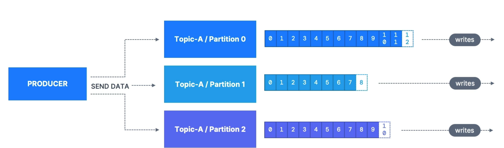
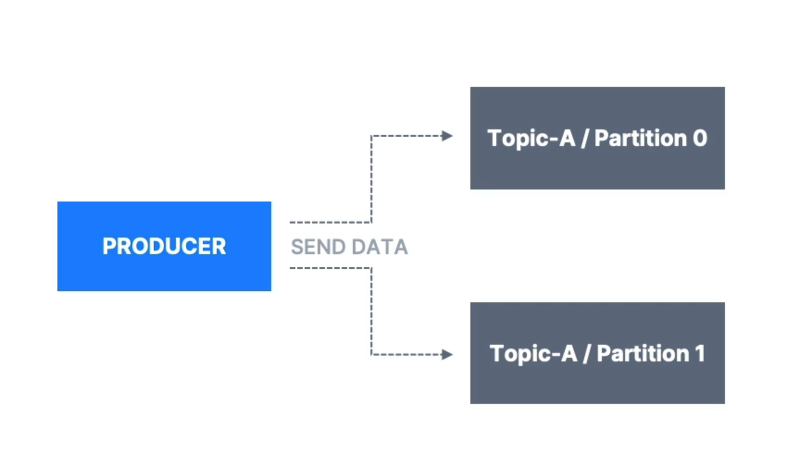
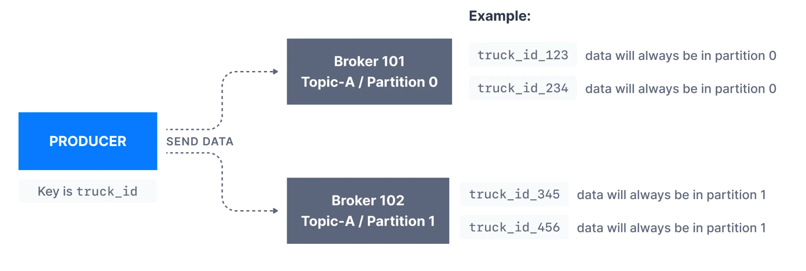
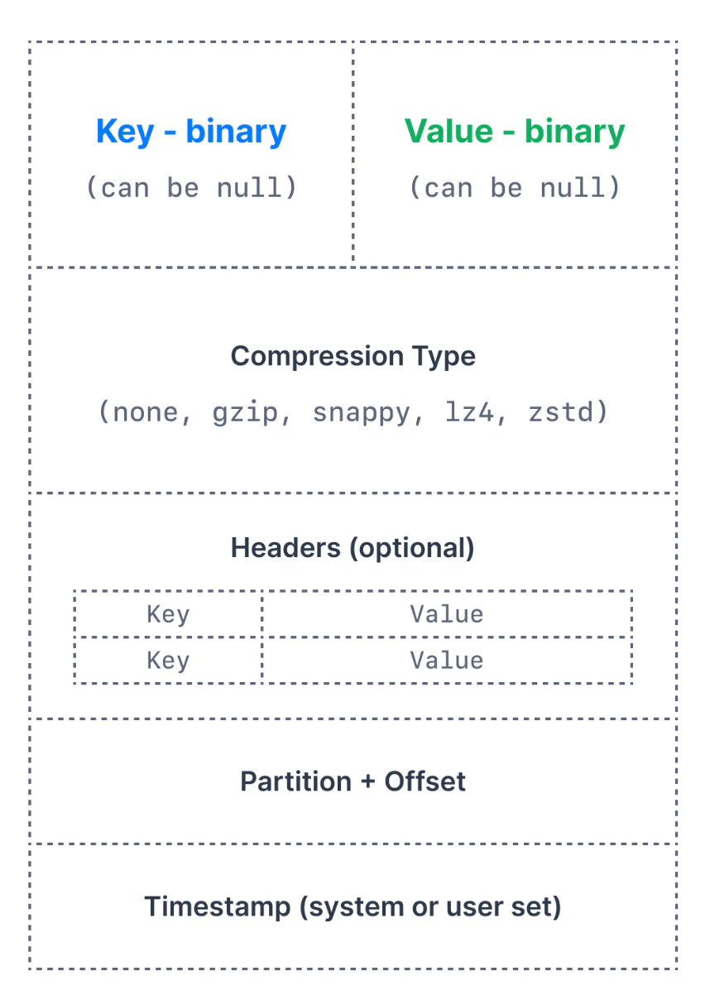

# Producers

Los Produces escriben los datos en los topics, ellos saben automáticamente en qué broker y partition escribir aunque haya algún broker caído.

    

 

Los productores pueden enviar una **key** en cada mensaje(string, int, etc...). Si key=null, los datos se envían de forma rotatoria y se obtiene un equilibro de carga:

    

 

En cambio, si key!=null,  los mensajes que tenga esa key ira siempre a la misma partición gracias a una estrategia hashing. Normalmente cuando se pone una key es para queder ordenar algún dato en concreto, ya que, solo hay ordenación por topic-partition consiguiendo de está forma una ordenación concreta.

Por ejemplo en esta foto se elige como key *truck_id*, de manera que la primera vez irá a una partición, pero cuando un id llegue a una partición, siempre irá a la misma:

- partition 0
    - truck_id_123
    - truck_id_234
- partition 1
    - truck_id_345
    - truck_id_456

    

 

## Mensaje

### Estructura

Cuando crea un mensaje un producer tiene las siguientes partes:

    

 

- **Key**: Lo mencionado anteriormente, una key es opcional en el mensaje Kafka y puede ser null. Una key puede ser una cadena, un número o cualquier objeto y luego la clave se serializa en formato binario

- **Value**: El value representa el contenido del mensaje y también puede ser nulo. El formato del valor es arbitrario y luego también se serializa en formato binario

- **Compression Type**: Los mensajes de Kafka pueden ser comprimidos. El tipo de compresión puede especificarse como parte del mensaje. Las opciones son:
    - none
    - gzip
    - lz4
    - snappy
    - zstd

- **Headers**: Puede haber una lista de cabeceras de mensajes Kafka opcionales en forma de pares key-value. Es habitual añadir cabeceras para especificar metadatos sobre el mensaje, especialmente para el seguimiento

- **Partition + Offset**: Una vez que se envia un mensaje, se pone el número de partition y offset para poder identificarlo y encontrarlo

-  **Timestamp**: El usuario o el sistema añaden una marca de tiempo en el mensaje.

### Serializer
Kafka como acepta como mensajes Bytes, esto lo hace a través de serelizar, lo que consigue es transformar cualquier tipo a bytes para tener una mayor rápidez de mensajes. Por ejemplo se va enviar un mensaje que tenga un key = 103 y un value = "hello word", se haria de la siguiente manera la transformación:

    

 

## Acks

Los productores pueden recibir acks de escritura:
- ack=0: el productor no espera ack (posible perdida de datos)
- ack=1: el líder hace confirmación de datos pero no la replica. Hay una pérdida limitada de datos si se cae el líder y la replica no esta replicada
- acks=all: el líder y la replica hace confirmación (no hay perdida de datos)

